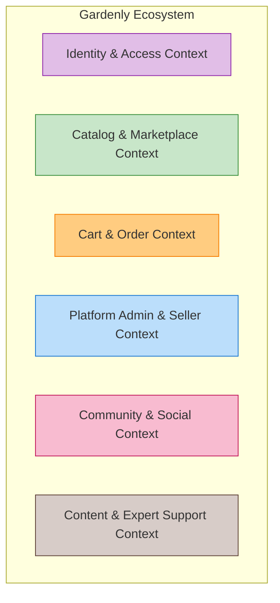
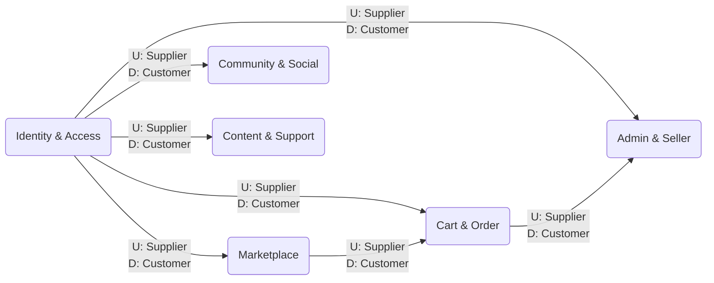
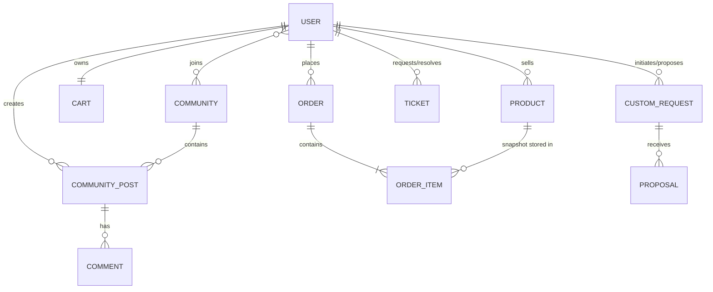
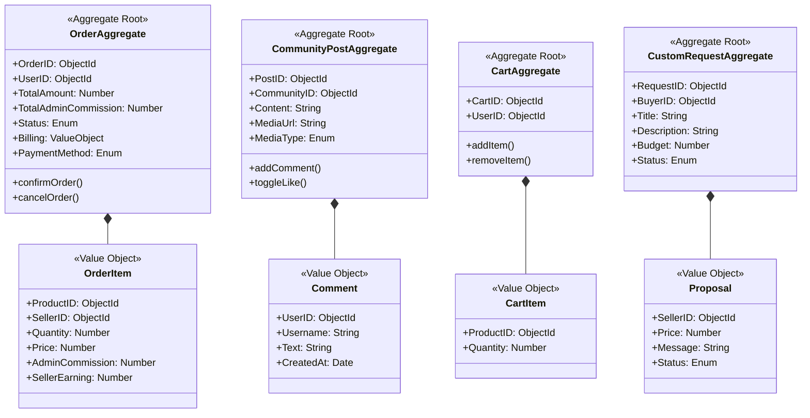

# Domain-Driven Design (DDD) Architecture Report

## 1. Project Title & Description

**Project Title:** Gardenly - Community-Driven E-Commerce Ecosystem

**Description:**
Gardenly is an enterprise-grade, full-stack web application built on the MERN stack (MongoDB, Express, React, Node.js) designed to bridge the gap between gardening enthusiasts, horticulturists, and vendors. It functions as a hybrid platform that seamlessly integrates a high-performance e-commerce marketplace with a real-time social networking ecosystem. The platform enforces strict Domain-Driven Design principles across both the React frontend and Node.js backend. 

The system supports a multi-actor model with specialized roles: **Buyers, Sellers, Admins, and Experts**. The e-commerce facet handles catalog management, cart aggregation, custom buyer-to-seller plant requests, secure order processing, and split-revenue calculations between sellers and the platform. The social facet leverages Socket.io for a real-time, rich-media community feed, alongside an expert ticketing system for horticultural support. The architecture leverages Redis for caching and Cloudinary for media management, ensuring high availability, strict boundary encapsulation, and a scalable structure.

---

## 2. Domain-Driven Design (DDD)

### a) Bounded Contexts & System Mapping

The Gardenly domain is strategically decomposed into highly cohesive Bounded Contexts. Every file (model, controller, route, and frontend page) belongs to a distinct context to ensure absolute separation of concerns.

#### 1. Identity & Access Management (IAM) Context
*   **Responsibility:** Authentication (JWT), Authorization (RBAC), 2FA, Email Verification, and User Profile Management.
*   **Backend Models:** `user.model.js`
*   **Backend Controllers:** `auth.controller.js`, `user.controller.js`
*   **Backend Routes:** `auth.route.js`, `user.route.js`
*   **Frontend UI Pages:** `SignIn.jsx`, `SignUp.jsx`, `Profile.jsx`

#### 2. Catalog & Marketplace Context
*   **Responsibility:** Product browsing, categorization, search, and custom plant requests from buyers to sellers.
*   **Backend Models:** `product.model.js`, `customRequest.model.js`
*   **Backend Controllers:** `product.controller.js`, `customRequest.controller.js`
*   **Backend Routes:** `product.route.js`, `customRequest.route.js`
*   **Frontend UI Pages:** `Home.jsx`, `Plants.jsx`, `Seeds.jsx`, `Pots.jsx`, `SearchResults.jsx`, `CustomRequests.jsx`

#### 3. Cart & Order Context
*   **Responsibility:** Shopping cart state aggregation, order checkout lifecycle, pricing snapshots, and payment processing.
*   **Backend Models:** `cart.model.js`, `order.model.js`
*   **Backend Controllers:** `cart.controller.js`, `order.controller.js`
*   **Backend Routes:** `cart.route.js`, `order.route.js`
*   **Frontend UI Pages:** `Cart.jsx`

#### 4. Platform Administration & Seller Management Context
*   **Responsibility:** Global oversight of users, products, and tickets by Admins; revenue tracking and specific order fulfillment by Sellers.
*   **Backend Models:** Interacts with `order.model.js`, `product.model.js`, `user.model.js`
*   **Backend Controllers:** `admin.controller.js`, `seller.controller.js`
*   **Backend Routes:** `admin.route.js`, `seller.route.js`
*   **Frontend UI Pages:** `AdminDashboard.jsx`, `AdminOrders.jsx`, `AdminProducts.jsx`, `AdminTickets.jsx`, `AdminUsers.jsx`, `Seller.jsx`

#### 5. Community & Social Context
*   **Responsibility:** Real-time user interactions, communities, multimedia posts, likes, and comments via WebSockets.
*   **Backend Models:** `community.model.js`, `communityPost.model.js`
*   **Backend Controllers:** `community.controller.js`, `communityPost.controller.js`
*   **Backend Routes:** `community.route.js`
*   **Frontend UI Pages:** `Community.jsx`

#### 6. Content & Expert Support Context
*   **Responsibility:** Curated horticultural articles (Blogs) and expert-led support ticketing for user queries.
*   **Backend Models:** `blog.model.js`, `ticket.model.js`
*   **Backend Controllers:** `blog.controller.js`, `ticket.controller.js`
*   **Backend Routes:** `blog.route.js`, `ticket.route.js`
*   **Frontend UI Pages:** `Blog.jsx`, `About.jsx`, `ExpertDashboard.jsx`, `ExpertSupport.jsx`

#### Bounded Contexts Diagram

---

### b) Context Mappings

*   **IAM Context** acts as an **Upstream / Shared Kernel**. Every other context relies on IAM for JWT validation and role validation.
*   **Marketplace Context** is **Upstream** to the **Order Context**. An Order cannot be instantiated without fetching a snapshot from the Product Catalog.
*   **Order Context** is **Downstream** to the **Admin & Seller Context**, which reads and updates order statuses.

#### Context Mapping Diagram

---

### c) Entities, Value Objects, and Domain Services

#### 1. Identity & Access Context
*   **Entities:** `User`
*   **Value Objects:** `Role` (Buyer, Seller, Admin, Expert), `Credentials` (PasswordHash, 2FA OTP, Reset OTP), `ContactInfo` (Mobile).
*   **Services:** `AuthService` (JWT generation, Bcrypt hashing), `NotificationService` (Nodemailer OTP dispatch).

#### 2. Catalog & Marketplace Context
*   **Entities:** `Product`, `CustomRequest`.
*   **Value Objects:** `ProductDetails` (Name, Description, Category, Image), `Money` (Price, Budget), `Proposal` (SellerID, Price, Message, Status).
*   **Services:** `CatalogService` (Solr-based full-text indexing), `CustomRequestService`.

#### 3. Cart & Order Context
*   **Entities:** `Cart`, `Order`.
*   **Value Objects:** `CartItem` (ProductID, Quantity), `OrderItem` (ProductID, Quantity, SnapshotPrice), `BillingAddress` (FullName, Phone, Address, City, State, Pincode), `RevenueSplit` (AdminCommission, SellerEarning), `PaymentDetails` (PaymentID, Method, OTP).
*   **Services:** `CheckoutService`, `RevenueCalculationService` (Calculates 90% seller / 10% admin splits).

#### 4. Platform Administration & Seller Management Context
*   **Entities:** Relies on existing `User`, `Order`, and `Product` entities.
*   **Value Objects:** `DashboardStats` (TotalRevenue, ActiveUsers, OutOfStock).
*   **Services:** `AdminAnalyticsService`, `SellerAnalyticsService`.

#### 5. Community & Social Context
*   **Entities:** `Community`, `CommunityPost`.
*   **Value Objects:** `CommunityMetadata` (Name, Description, Category), `MediaContent` (Type, URL), `Comment` (UserID, Text, Timestamp), `Like` (UserID).
*   **Services:** `RealTimeSocketService` (Emitting `new_post`, `new_comment`, `new_like`).

#### 6. Content & Support Context
*   **Entities:** `Ticket`, `Blog`.
*   **Value Objects:** `TicketDetails` (Requester, Subject, Type, Description, Attachment), `TicketResolution` (Status, ResolutionText), `BlogContent` (Title, Content, Excerpt, Image).
*   **Services:** `TicketingService`, `BlogService`.

---

### d) Cardinality Ratios

| Source Entity | Ratio | Target Entity | Business Rule / Description |
| :--- | :---: | :--- | :--- |
| **User (Seller)** | `1 : N` | **Product** | One Seller manages multiple Products in the catalog. |
| **User (Buyer)** | `1 : 1` | **Cart** | A Buyer has exactly one active Cart aggregate. |
| **User (Buyer)** | `1 : N` | **Order** | A Buyer can have an infinite history of Orders. |
| **Order** | `1 : N` | **Product (Snapshot)** | An Order encapsulates multiple CartItems at snapshot prices. |
| **User (Any)** | `M : N` | **Community** | Users can join many Communities; Communities hold many Users. |
| **Community** | `1 : N` | **CommunityPost** | A Community acts as a container for many Posts. |
| **CommunityPost** | `1 : N` | **Comment** | A Post contains multiple Comments stored as sub-documents. |
| **CustomRequest** | `1 : N` | **Proposal** | A Buyer's Request receives multiple Proposals from Sellers. |
| **User (Expert)** | `1 : N` | **Ticket** | An Expert manages a queue of multiple assigned Tickets. |

#### ERD / Cardinality Diagram

---

### e) Aggregates of the Model

Aggregates define transaction boundaries. In Gardenly, we leverage MongoDB document structures to enforce these bounds strictly.

1.  **User Aggregate (Root: `User`)**
    *   **Invariants:** Email must be verified before login. Role cannot be mutated.
    *   **Sub-components:** Array of `joinedCommunities`.

2.  **Product Aggregate (Root: `Product`)**
    *   **Invariants:** Quantity cannot drop below 0. 
    *   **Sub-components:** Stored directly.

3.  **Cart Aggregate (Root: `Cart`)**
    *   **Invariants:** Cannot hold items with 0 quantity. Enforces unique `user_id` index.
    *   **Sub-components:** Embedded array of `items` (Value Objects with `ProductID` and `Quantity`).

4.  **Order Aggregate (Root: `Order`)**
    *   **Invariants:** Once an order moves from `pending_otp` to `confirmed`, `totalAmount` and item `price` cannot change.
    *   **Sub-components:** Embedded array of `items` (containing snapshot `price`, `sellerId`, `adminCommission`, `sellerEarning`). Embedded `billing` address object.

5.  **Community Aggregate (Root: `Community`)**
    *   **Invariants:** Name must be unique.
    *   **Sub-components:** Array of member `UserIDs`.

6.  **CommunityPost Aggregate (Root: `CommunityPost`)**
    *   **Invariants:** Must belong to a valid `CommunityID`.
    *   **Sub-components:** `Comments` array (Value Objects with UserID, Text, Timestamp) and `Likes` array. Transactionally, adding a comment updates the Post document.

7.  **Custom Request Aggregate (Root: `CustomRequest`)**
    *   **Invariants:** Status transitions strictly from `Open` → `Confirmed` → `Completed`.
    *   **Sub-components:** Embedded array of `proposals` (SellerID, Price, Message, Status).

8.  **Support Ticket Aggregate (Root: `Ticket`)**
    *   **Invariants:** Transitions from `Open` to `Resolved`.
    *   **Sub-components:** `resolution` details and `resolved_at` timestamp.

9.  **Blog Aggregate (Root: `Blog`)**
    *   **Invariants:** Slug must be unique.
    *   **Sub-components:** Array of `Comments` and `Likes`.

#### Aggregates Class Diagram

---
*Generated by the Technical Lead - Final Submission Copy.*
