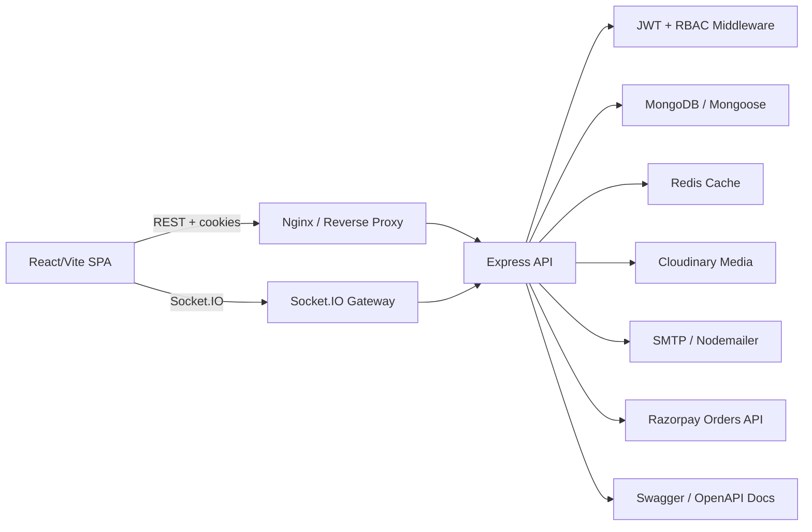
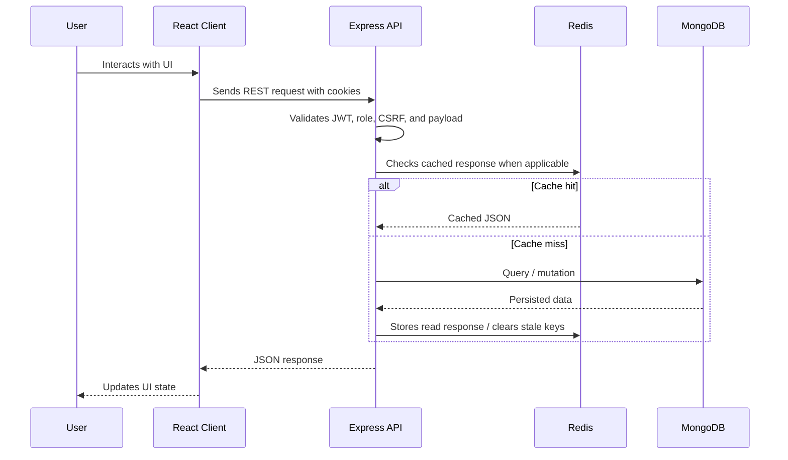
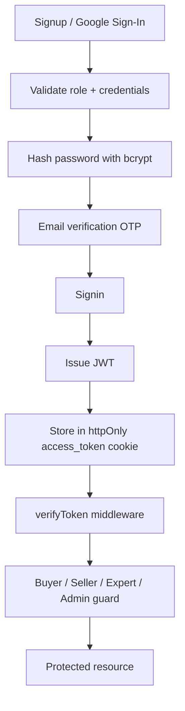
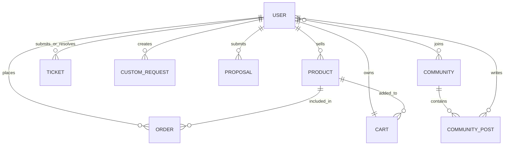
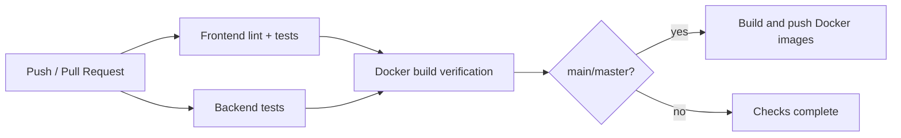

# Gardenly

<div align="center">

**A production-minded MERN marketplace for plants, gardening products, expert support, custom buyer requests, and community-led commerce.**

Gardenly connects buyers, sellers, experts, and administrators through a secure full-stack platform with role-based workflows, real-time community updates, Redis-backed caching, Dockerized deployment, and a documented REST API.

</div>

---

## Badges
<p align="center">
  
  
  
  
  
  
  
  
  
</p>

---

## Table Of Contents

- [About The Project](#about-the-project)
- [Key Features](#key-features)
- [Tech Stack](#tech-stack)
- [System Architecture](#system-architecture)
- [Folder Structure](#folder-structure)
- [Installation & Setup](#installation--setup)
- [Environment Variables](#environment-variables)
- [API Documentation](#api-documentation)
- [Database Design](#database-design)
- [Authentication & Security](#authentication--security)
- [Performance Optimizations](#performance-optimizations)
- [Scalability Features](#scalability-features)
- [Screenshots](#screenshots)
- [Deployment](#deployment)
- [CI/CD Pipeline](#cicd-pipeline)
- [Testing](#testing)
- [Future Improvements](#future-improvements)
- [Contributing Guide](#contributing-guide)
- [License](#license)
- [Contact Information](#contact-information)
- [Acknowledgements](#acknowledgements)

---

## About The Project

Gardenly is a full-stack commerce platform built for the gardening ecosystem. It supports product discovery, buyer checkout, seller inventory management, custom request bidding, expert support tickets, gardening content, and moderated community engagement from one cohesive application.

The project exists to solve a real marketplace coordination problem: gardening buyers often need more than a product listing. They may need trusted sellers, expert support, community advice, custom bulk requests, product search, secure checkout, and post-purchase support. Gardenly models those workflows as first-class platform capabilities rather than isolated screens.

**Target users**

| User Type | Primary Goals |
| :--- | :--- |
| Buyers | Browse plants, seeds, and pots; manage cart; place OTP or Razorpay-backed orders; request custom products; create support tickets. |
| Sellers | Manage inventory, receive seller-specific order views, track sales summaries, and respond to buyer custom requests. |
| Experts | Resolve assigned support tickets and provide structured assistance to customers. |
| Admins | Moderate users, products, orders, tickets, blogs, communities, posts, and custom requests through a dedicated dashboard. |

The architecture matters because Gardenly is not only a CRUD app. It has authenticated role boundaries, cross-collection consistency, server-side payment verification, Redis response caching, Cloudinary-backed media handling, Socket.IO community updates, and Docker/Nginx deployment paths. Those engineering choices make the system easier to operate, test, extend, and scale.

---

## Key Features

| Area | Capabilities |
| :--- | :--- |
| Authentication | Buyer, Seller, Expert, and Admin roles; JWT cookie sessions; Google sign-in; email verification OTP; password reset OTP; role mismatch protection. |
| Dashboard | Admin analytics, seller summary metrics, expert ticket dashboard, buyer profile, cart, order, and request views. |
| Backend | Express 5 API, modular routes/controllers/models, Mongoose schemas, structured error handling, rotating access/error logs. |
| Performance | Redis cache middleware, cache invalidation on writes, MongoDB indexes, pagination, lazy-loaded React routes, Cloudinary image transformation. |
| Security | httpOnly auth cookies, bcrypt password hashing, RBAC middleware, Helmet headers, CORS allowlist, CSRF token flow, auth route rate limiting. |
| Admin | User/product/order/ticket/blog/community/post/custom-request administration with protected admin routes. |
| Analytics | Admin platform metrics, seller order summaries, revenue commission calculation, top/recent sales views. |
| Notifications | Email OTP flows through Nodemailer and real-time community events through Socket.IO. |
| API | REST endpoints, Swagger/OpenAPI route documentation, consistent JSON responses, status-code driven error handling. |
| Responsive UI | React/Vite SPA with Tailwind CSS, route-level code splitting, reusable layout components, mobile-ready public and admin interfaces. |
| Scalability | Modular service boundaries, Redis-ready cache layer, Docker Compose networking, Nginx reverse proxy, queue-ready architecture for async workloads. |

---

## Tech Stack

| Category | Technology |
| :--- | :--- |
| Frontend | React 19, Vite 7, React Router 7, Socket.IO Client |
| Backend | Node.js 20, Express 5, Mongoose 8, Socket.IO |
| Database | MongoDB with Mongoose schemas and collection-level indexes |
| Authentication | JWT, httpOnly cookies, bcryptjs, Google OAuth ID token verification |
| Caching | Redis, route-level response cache middleware, cache invalidation utilities |
| Cloud | Cloudinary for image storage and transformation |
| DevOps | Docker, Docker Compose, Nginx, GitHub Actions |
| Deployment | Vercel-ready frontend, Render/Railway-ready API, Docker/Nginx production stack, AWS-compatible container deployment |
| State Management | Redux Toolkit, React Context providers |
| Styling | Tailwind CSS, React Icons, Lucide React, Heroicons |
| Testing | Jest, Supertest, Vitest, React Testing Library, jsdom |
| Monitoring | Morgan access logs, rotating file streams, structured error logs, Swagger UI, Redis health endpoint |

---

## System Architecture

Gardenly follows a modular MERN architecture with a clear split between client rendering, API orchestration, persistence, caching, media storage, and real-time communication.



> Architecture diagram placeholder: `docs/diagrams/system-architecture.png`

### Frontend Architecture

- React SPA built with Vite and SWC for fast development/build cycles.
- Route-level lazy loading via `React.lazy` and `Suspense` to reduce initial bundle pressure.
- Public and admin layouts are separated so admin screens can evolve independently.
- Redux Toolkit stores shared auth/cart/product state, while Context providers handle auth, cart, and Socket.IO concerns.
- API calls use cookie credentials and a CSRF-aware fetch wrapper for unsafe methods.

### Backend Architecture

- Express API is organized by domain: auth, users, products, cart, orders, admin, seller, tickets, blogs, communities, and custom requests.
- Controllers own request orchestration; Mongoose models define persistence contracts; middleware centralizes auth and role enforcement.
- Central error handling normalizes API failures and hides server details in production.
- Morgan and rotating-file-stream provide access/error log retention for operational observability.

### API Flow



### Database Design

- MongoDB stores users, products, carts, orders, tickets, blogs, communities, community posts, and custom buyer requests.
- Relationships are modeled with ObjectId references and populated where richer read views are needed.
- Write workflows clear relevant Redis keys to keep cached reads consistent.
- Order confirmation uses a MongoDB session/transaction pattern to decrement stock, update sales counters, clear the cart, and confirm the order atomically.

### Worker Queues

Gardenly is queue-ready by design. Email delivery, image processing, analytics aggregation, and notification fan-out are isolated behind utility/service boundaries and can be moved to BullMQ or a Redis-backed worker process without changing the public API contract.

### Caching Layer

- Redis stores read-heavy JSON responses with configurable TTLs.
- Cache keys are scoped by route and user identity where private data is involved.
- Mutations clear product, cart, profile, seller, community, ticket, and admin-related cache namespaces.
- API responses expose `X-Redis-Cache` headers to make cache behavior easier to inspect.

### Authentication Flow



---

## Folder Structure

```text
GardenlyReact/
├── .github/
│   └── workflows/
│       └── ci.yml                    # CI checks for frontend, backend, and Docker builds
├── api/
│   ├── config/
│   │   └── swagger.js                # OpenAPI/Swagger documentation server
│   ├── controllers/                  # Request orchestration by domain
│   ├── logs/                         # Rotating access/error logs
│   ├── middleware/                   # JWT, RBAC, logger, and request guards
│   ├── models/                       # Mongoose schemas and indexes
│   ├── public/                       # Static images served by the backend
│   ├── routes/                       # REST route definitions
│   ├── scripts/                      # Seed/migration/service verification scripts
│   ├── tests/                        # Backend Jest/Supertest test suites
│   ├── uploads/                      # Local upload artifacts and ticket resolutions
│   ├── utils/                        # Redis cache, mailer, Razorpay, error helpers
│   ├── index.js                      # Express app, middleware, sockets, startup
│   └── upload.js                     # Cloudinary + Multer upload pipeline
├── client/
│   ├── public/                       # Static client assets
│   ├── src/
│   │   ├── components/               # Shared UI components
│   │   ├── context/                  # Auth, cart, and socket providers
│   │   ├── layouts/                  # Admin layout shell
│   │   ├── pages/                    # Public, buyer, seller, expert, admin pages
│   │   ├── redux/                    # Redux Toolkit store and slices
│   │   ├── utils/                    # CSRF fetch and image helpers
│   │   ├── App.jsx                   # Route composition and lazy loading
│   │   └── main.jsx                  # Client entry point
│   ├── vite.config.js                # Vite, proxy, and Vitest config
│   └── vercel.json                   # Vercel SPA routing config
├── Dockerfile.backend                # Production API container
├── Dockerfile.client                 # Multi-stage Vite build + Nginx container
├── docker-compose.yml                # API, Redis, client/Nginx network
├── nginx.conf                        # SPA, API, docs, images, uploads, websocket proxy
├── api_documentation.md              # Human-readable REST API reference
├── performance_report.md             # Redis/indexing performance notes
├── package.json                      # Backend scripts and dependencies
└── README.md                         # Project documentation
```

---

## Installation & Setup

### Prerequisites

| Requirement | Recommended Version |
| :--- | :--- |
| Node.js | `20.x` or newer |
| npm | `10.x` or newer |
| MongoDB | Atlas or local MongoDB instance |
| Redis | Local Redis, Docker Redis, or managed Redis |
| Docker | Required only for containerized setup |
| Cloudinary | Required for production image uploads |
| SMTP provider | Required for OTP email flows |
| Razorpay test account | Required for Razorpay checkout testing |

### Clone The Repository

```bash
git clone https://github.com/SriHarshaRajuY/GardenlyReact.git
cd GardenlyReact
```

### Install Dependencies

```bash
npm install
npm install --prefix client
```

### Configure Environment Files

```bash
cp .env.example .env
cp client/.env.example client/.env
```

On Windows PowerShell:

```powershell
Copy-Item .env.example .env
Copy-Item client\.env.example client\.env
```

### Run Backend

```bash
npm run dev
```

Default API URL:

```text
http://localhost:3000
```

### Run Frontend

```bash
npm run client:dev
```

Default client URL:

```text
http://localhost:5173
```

### Docker Setup

The Docker Compose stack runs the backend API, Redis, and the production client served through Nginx.

```bash
docker compose up --build
```

Default Docker URLs:

```text
Client:    http://localhost
API:       http://localhost:3000
API Docs:  http://localhost/api-docs
Redis:     localhost:6379
```

> MongoDB is intentionally externalized. Set `MONGO_URI` in `.env` to a MongoDB Atlas or local MongoDB connection string before starting the stack.

### Production Setup

```bash
npm run client:build
npm start
```

Production checklist:

- Set `NODE_ENV=production`.
- Use a strong `JWT_SECRET`.
- Set `CLIENT_ORIGIN` to the deployed frontend origin.
- Set `VITE_BACKEND_URL` before building the client when frontend and backend are deployed separately.
- Use managed MongoDB, Redis, Cloudinary, SMTP, and Razorpay credentials.
- Serve the frontend through Vercel or Nginx and route `/api`, `/api-docs`, `/images`, `/uploads`, and `/socket.io` to the API.

---

## Environment Variables

### Backend `.env.example`

```env
MONGO_URI=your_mongodb_uri
PORT=3000
NODE_ENV=development
CLIENT_ORIGIN=http://localhost:5173

JWT_SECRET=your_jwt_secret
GOOGLE_CLIENT_ID=your_google_client_id

EMAIL_HOST=smtp.gmail.com
EMAIL_PORT=587
EMAIL_SECURE=false
EMAIL_USER=your_email@gmail.com
EMAIL_PASS=your_email_app_password
MAIL_FROM=Gardenly Support <your_email@gmail.com>

CLOUD_NAME=your_cloudinary_name
CLOUD_API_KEY=your_cloudinary_key
CLOUD_API_SECRET=your_cloudinary_secret

REDIS_URL=redis://localhost:6379

RAZORPAY_KEY_ID=your_razorpay_key_id
RAZORPAY_KEY_SECRET=your_razorpay_key_secret
```

### Frontend `client/.env.example`

```env
VITE_BACKEND_URL=http://localhost:3000
VITE_GOOGLE_CLIENT_ID=your_google_client_id
VITE_RAZORPAY_KEY_ID=your_razorpay_key_id
```

### Environment Notes

| Variable | Purpose |
| :--- | :--- |
| `MONGO_URI` | MongoDB connection string used by Mongoose. |
| `JWT_SECRET` | Secret used to sign and verify access tokens. |
| `CLIENT_ORIGIN` | Allowed frontend origin for CORS and cookies. |
| `REDIS_URL` | Redis connection URL for route-level caching. |
| `CLOUD_*` | Cloudinary configuration for image uploads. |
| `EMAIL_*` | SMTP configuration for OTP and verification emails. |
| `RAZORPAY_*` | Razorpay order creation and signature verification keys. |

Never commit real `.env` files. Rotate credentials immediately if they are exposed in a public repository, issue, screenshot, or log.

---

## API Documentation

Base API URL:

```text
http://localhost:3000/api
```

Interactive Swagger documentation:

```text
http://localhost:3000/api-docs
```

### Authentication Routes

| Method | Endpoint | Access | Description |
| :--- | :--- | :--- | :--- |
| `POST` | `/auth/signup` | Public | Create Buyer, Seller, or Expert account and send email verification OTP. |
| `POST` | `/auth/verify-email` | Public | Verify signup OTP. |
| `POST` | `/auth/signin` | Public | Authenticate user and issue JWT cookie. |
| `POST` | `/auth/verify-2fa` | Public | Verify stored 2FA OTP when enabled by flow. |
| `POST` | `/auth/google` | Public | Authenticate with Google ID token. |
| `POST` | `/auth/forgot-password` | Public | Send password reset OTP. |
| `POST` | `/auth/reset-password` | Public | Reset password with OTP. |
| `POST` | `/auth/logout` | Public | Clear authentication cookie. |
| `GET` | `/auth/check` | Public | Check current cookie auth state. |
| `GET` | `/user/me` | Authenticated | Return current user profile. |

### Product, Cart, And Order Routes

| Method | Endpoint | Access | Description |
| :--- | :--- | :--- | :--- |
| `GET` | `/products` | Public | Paginated recent products. |
| `GET` | `/products/category/:category` | Public | Paginated products by category. |
| `GET` | `/products/search?q=rose` | Public | Weighted text search for products. |
| `POST` | `/products` | Seller | Create product with Cloudinary image upload. |
| `GET` | `/products/seller` | Seller | List products owned by the current seller. |
| `GET` | `/products/top-sales` | Seller | Top selling products for seller analytics. |
| `GET` | `/products/recent-sales` | Seller | Recent seller sales view. |
| `PUT` | `/products/:id` | Seller owner | Update owned product. |
| `DELETE` | `/products/:id` | Seller owner | Delete owned product and clean carts/cache. |
| `GET` | `/cart` | Buyer | Fetch current buyer cart. |
| `POST` | `/cart/add` | Buyer | Add product to cart. |
| `PUT` | `/cart/update` | Buyer | Update cart item quantity. |
| `DELETE` | `/cart/remove/:productId` | Buyer | Remove product from cart. |
| `POST` | `/orders/send-otp` | Buyer | Create OTP-backed order confirmation. |
| `POST` | `/orders/verify-otp` | Buyer | Confirm COD order and update inventory. |
| `POST` | `/orders/create-razorpay-order` | Buyer | Create Razorpay order from authenticated cart. |
| `POST` | `/orders/verify-razorpay-payment` | Buyer | Verify Razorpay signature and confirm order. |

### Community, Blog, Support, And Request Routes

| Method | Endpoint | Access | Description |
| :--- | :--- | :--- | :--- |
| `GET` | `/blogs` | Public | Cached blog listing. |
| `GET` | `/blogs/:slug` | Public | Cached blog detail. |
| `POST` | `/blogs/:id/like` | Authenticated | Like/unlike blog. |
| `POST` | `/blogs/:id/comment` | Authenticated | Comment on blog. |
| `POST` | `/blogs` | Admin | Create blog. |
| `PUT` | `/blogs/:id` | Admin | Update blog. |
| `DELETE` | `/blogs/:id` | Admin | Delete blog. |
| `GET` | `/community` | Authenticated | Joined and suggested communities. |
| `POST` | `/community` | Authenticated | Create community. |
| `POST` | `/community/join/:id` | Authenticated | Join community. |
| `POST` | `/community/leave/:id` | Authenticated | Leave community. |
| `GET` | `/community/posts` | Community member | List posts for a joined community. |
| `POST` | `/community/posts` | Community member | Create community post. |
| `POST` | `/community/posts/:id/like` | Community member | Like/unlike post. |
| `POST` | `/community/posts/:id/comment` | Community member | Comment on post. |
| `POST` | `/tickets/submit` | Buyer | Submit support ticket with optional attachment. |
| `GET` | `/tickets/user` | Buyer | List buyer tickets. |
| `GET` | `/tickets/expert` | Expert | List expert-assigned tickets. |
| `POST` | `/tickets/:id/resolve` | Expert | Resolve assigned ticket. |
| `POST` | `/custom-requests` | Buyer | Create custom buyer request. |
| `GET` | `/custom-requests/my-requests` | Buyer | List buyer's requests. |
| `GET` | `/custom-requests/open` | Seller | List open buyer requests. |
| `POST` | `/custom-requests/:id/proposals` | Seller | Submit proposal. |
| `PUT` | `/custom-requests/:id/proposals/:proposalId/accept` | Buyer | Accept seller proposal. |

### Admin Routes

| Method | Endpoint | Description |
| :--- | :--- | :--- |
| `GET` | `/admin/dashboard` | Platform metrics and recent activity. |
| `GET` | `/admin/users` | List users without sensitive credential fields. |
| `DELETE` | `/admin/users/:id` | Delete user and related records. |
| `GET` | `/admin/products` | List all products with seller metadata. |
| `DELETE` | `/admin/products/:id` | Delete product and clean dependent carts/cache. |
| `GET` | `/admin/orders` | List orders with user/product references. |
| `GET` | `/admin/tickets` | List support tickets. |
| `PATCH` | `/admin/tickets/:id/resolve` | Resolve ticket as admin. |
| `GET` | `/admin/blogs` | List blogs. |
| `DELETE` | `/admin/blogs/:id` | Delete blog. |
| `GET` | `/admin/communities` | List communities. |
| `DELETE` | `/admin/communities/:id` | Delete community and related posts. |
| `GET` | `/admin/posts` | List community posts. |
| `DELETE` | `/admin/posts/:id` | Delete post. |
| `GET` | `/admin/custom-requests` | List custom requests. |
| `DELETE` | `/admin/custom-requests/:id` | Delete custom request. |

### Response Examples

Successful sign-in:

```json
{
  "success": true,
  "token": "jwt-token",
  "user": {
    "_id": "65f0c2f2c2a1b2c3d4e5f678",
    "username": "garden_buyer",
    "email": "buyer@example.com",
    "role": "Buyer",
    "isEmailVerified": true
  }
}
```

Paginated product response:

```json
{
  "products": [
    {
      "_id": "65f0c2f2c2a1b2c3d4e5f678",
      "name": "Aloe Vera",
      "category": "Plants",
      "price": 299,
      "quantity": 12,
      "image": "https://res.cloudinary.com/example/image/upload/gardenly/images/aloe.png"
    }
  ],
  "currentPage": 1,
  "totalPages": 4,
  "totalProducts": 42
}
```

Error response:

```json
{
  "success": false,
  "status": 403,
  "message": "Admin required"
}
```

### Status Codes

| Code | Meaning |
| :--- | :--- |
| `200` | Request completed successfully. |
| `201` | Resource created successfully. |
| `400` | Validation error, invalid payload, expired OTP, or bad business request. |
| `401` | Missing authentication cookie or invalid login credentials. |
| `403` | Authenticated user does not have the required role or token is invalid. |
| `404` | Requested resource does not exist. |
| `429` | Auth rate limit exceeded. |
| `500` | Server or integration configuration failure. |

<details>
<summary><strong>cURL Examples</strong></summary>

```bash
curl -X POST http://localhost:3000/api/auth/signin \
  -H "Content-Type: application/json" \
  -d '{"username":"garden_buyer","password":"Secure@123","role":"Buyer"}' \
  -i
```

```bash
curl "http://localhost:3000/api/products/search?q=aloe"
```

</details>

---

## Database Design

Gardenly uses MongoDB collections with explicit Mongoose schemas, reference relationships, enum constraints, and targeted indexes for high-traffic access patterns.

| Collection | Purpose | Key Relationships | Important Indexes |
| :--- | :--- | :--- | :--- |
| `users` | Stores account, role, auth, OTP, expertise, and community membership data. | Joins communities, owns products, places orders, submits tickets. | `role`, unique `username`, unique `email`, unique `mobile`. |
| `products` | Seller inventory with category, price, stock, sales counters, and media URL. | References `User` via `seller_id`; referenced by carts and orders. | `category + createdAt`, weighted text index, `seller_id`. |
| `carts` | One active cart per buyer. | References `User` via `user_id`; references `Product` in items. | Unique `user_id`. |
| `orders` | Buyer orders with seller revenue split, admin commission, payment metadata, and billing snapshot. | References buyer `User`, ordered `Product`, item seller `User`. | `userId + createdAt`, `items.sellerId`, `status`. |
| `tickets` | Buyer support tickets assigned to experts/admins. | References expert `User`; requester stored by username. | `status`, `requester`, `expert_id`. |
| `blogs` | Gardening content with likes and comments. | Likes/comments reference `User`. | Unique `slug`. |
| `communities` | Community spaces with category, admin, and members. | Admin/member references to `User`. | Unique `name`. |
| `communityposts` | Posts, comments, likes, and media for communities. | References `Community` and `User`. | `communityId + createdAt`. |
| `customrequests` | Buyer-created requests with seller proposals. | Buyer and seller references to `User`. | `buyer_id`, `status`. |

### Relationship Overview



---

## Authentication & Security

| Control | Implementation |
| :--- | :--- |
| JWT/Auth | Successful login signs a 7-day JWT and stores it in an `httpOnly` `access_token` cookie. |
| Password Hashing | Passwords are hashed with `bcryptjs` before persistence. |
| RBAC | `requireBuyer`, `requireSeller`, `requireExpert`, and `requireAdmin` middleware guard role-specific routes. |
| Rate Limiting | Auth routes are protected with `express-rate-limit` to reduce brute-force pressure. |
| Validation | Controllers enforce role allowlists, category enums, password policy, mobile/email format, billing validation, quantity constraints, and ObjectId checks. |
| CORS | Backend uses a configured `CLIENT_ORIGIN` and credentials-aware CORS. |
| Helmet | Security headers are enabled globally, with a scoped CSP override for Swagger UI. |
| CSRF Protection | The API issues a `csrf_token` cookie and expects matching `X-CSRF-Token` headers on unsafe cross-site requests. |
| Upload Hardening | Multer validates image MIME types/extensions and limits uploads to 5 MB before Cloudinary storage. |
| Payment Verification | Razorpay payment confirmation uses HMAC SHA-256 and `timingSafeEqual` for signature comparison. |
| Error Hygiene | Production error responses avoid leaking stack traces for server failures. |

Recommended production hardening:

- Add request body sanitization middleware such as `express-mongo-sanitize` for defense-in-depth against operator injection.
- Enforce HTTPS at the edge and use secure cookies in production.
- Store secrets in a platform secret manager rather than repository files.
- Add centralized audit logs for admin destructive operations.

---

## Performance Optimizations

| Strategy | Implementation |
| :--- | :--- |
| Lazy Loading | React routes are loaded with `React.lazy` and `Suspense` to reduce initial JavaScript cost. |
| Pagination | Product listing and category endpoints support page/limit pagination with server-side caps. |
| Indexing | MongoDB indexes target category browsing, seller inventory, order history, support queues, custom requests, and product text search. |
| Caching | Redis middleware caches high-read routes and includes user-scoped cache keys where needed. |
| Redis Headers | Responses expose `X-Redis-Cache` to indicate cache hits/misses during inspection. |
| Code Splitting | Vite production builds split route chunks automatically through dynamic imports. |
| Image Optimization | Cloudinary storage applies a width-limited transformation and validates upload types. |
| Background Jobs | Email, media, and notification workflows are isolated enough to move into Redis/BullMQ workers as traffic grows. |
| Search Load Control | Product search is routed through explicit search submission rather than firing network calls on every keystroke. For live search, debouncing should be added at the input layer. |
| Cache Invalidation | Writes clear related namespaces to prevent stale product, cart, seller, community, ticket, and admin reads. |

Measured cache impact from the performance report:

| Scenario | Response Time | Result |
| :--- | :--- | :--- |
| Cache miss | `252.83 ms` | Database-backed response. |
| Cache hit | `54.61 ms` | Redis-backed response. |
| Improvement | `~78.4% faster` | Lower database load and faster reads. |

---

## Scalability Features

- **Modular monolith foundation:** Domains are separated by route, controller, model, middleware, and utility boundaries.
- **Microservice readiness:** Auth, catalog, orders, payments, support, notifications, media, and community domains can be extracted independently later.
- **Horizontal scaling:** Stateless JWT cookie auth and externalized MongoDB/Redis allow multiple API containers behind a load balancer.
- **Async processing path:** OTP email, upload processing, notification fan-out, and analytics aggregation are natural candidates for Redis-backed workers.
- **Reusable services:** Cache, mailer, Razorpay, upload, error, and logging utilities are centralized.
- **Reverse proxy support:** Nginx routes SPA assets, API traffic, Swagger, static images, uploads, and Socket.IO websocket upgrades.
- **Containerized delivery:** API and client Dockerfiles allow repeatable builds across local, CI, and production environments.

---

---

## Deployment

### Vercel Frontend

```bash
cd client
npm install
npm run build
```

Set Vercel environment variables:

```env
VITE_BACKEND_URL=https://your-api.example.com
VITE_GOOGLE_CLIENT_ID=your_google_client_id
VITE_RAZORPAY_KEY_ID=your_razorpay_key_id
```

The included `client/vercel.json` supports SPA routing by rewriting all paths to `index.html`.

### Render Backend

Recommended settings:

| Setting | Value |
| :--- | :--- |
| Runtime | Node |
| Build Command | `npm ci` |
| Start Command | `npm start` |
| Health/API Docs | `/api-docs` |

Required environment variables:

```env
NODE_ENV=production
MONGO_URI=your_mongodb_uri
JWT_SECRET=your_jwt_secret
CLIENT_ORIGIN=https://your-frontend.vercel.app
REDIS_URL=your_redis_url
```

### Railway

Railway can host the API with a managed Redis plugin or external Redis URL. Configure:

```text
Start Command: npm start
Port:          PORT=3000
Variables:     Same as backend .env
```

### AWS

Production-ready AWS options:

| Layer | AWS Service |
| :--- | :--- |
| API container | ECS Fargate or Elastic Beanstalk |
| Frontend | S3 + CloudFront or containerized Nginx |
| MongoDB | MongoDB Atlas peered/VPC accessible |
| Redis | ElastiCache Redis |
| Secrets | AWS Secrets Manager |
| Logs | CloudWatch Logs |

### Docker

```bash
docker build -f Dockerfile.backend -t gardenly-api .
docker build -f Dockerfile.client -t gardenly-client .
docker compose up --build
```

For a separate frontend image build:

```bash
docker build -f Dockerfile.client \
  --build-arg VITE_BACKEND_URL=https://your-api.example.com \
  --build-arg VITE_GOOGLE_CLIENT_ID=your_google_client_id \
  --build-arg VITE_RAZORPAY_KEY_ID=your_razorpay_key_id \
  -t gardenly-client .
```

### Nginx

The provided Nginx configuration supports:

- SPA fallback for React Router.
- `/api/*` proxy to Express.
- `/api-docs` proxy to Swagger UI.
- `/socket.io/*` websocket upgrade proxy.
- `/images/*` and `/uploads/*` backend static asset proxy.

---

## CI/CD Pipeline

Gardenly includes a GitHub Actions workflow at `.github/workflows/ci.yml`.



Pipeline stages:

| Stage | What It Does |
| :--- | :--- |
| Frontend checks | Installs client dependencies, runs ESLint, runs Vitest. |
| Backend checks | Installs root dependencies and runs Jest/Supertest suites. |
| Docker verification | Builds backend and frontend Docker images. |
| Docker Hub publish | On main/master, pushes API and client images using Docker Hub secrets. |

Required CI/CD secrets for image publishing:

```text
DOCKER_USERNAME
DOCKER_PASSWORD
VITE_GOOGLE_CLIENT_ID
VITE_RAZORPAY_KEY_ID
```

---

## Testing

### Backend Tests

```bash
npm test
```

Coverage command:

```bash
npm run test:coverage
```

Backend coverage includes controller-level API behavior with Jest, Supertest, and MongoDB Memory Server.

### Frontend Tests

```bash
npm run client:test
```

Coverage command:

```bash
npm run test:coverage --prefix client
```

Frontend tests use Vitest, React Testing Library, jsdom, and Jest DOM matchers.

### Linting

```bash
npm run client:lint
```

### Build Verification

```bash
npm run client:build
docker compose up --build
```

### API Testing

Use Swagger UI at `/api-docs`, cURL, Postman, or automated Supertest suites. Prioritize coverage for:

- Auth and role boundaries.
- Product CRUD and seller ownership.
- Cart and order confirmation flows.
- Razorpay signature verification.
- Admin destructive operations.
- Redis cache hit/miss behavior.

### Performance Testing

```bash
node api/utils/performanceTest.js
```

Recommended performance checks:

- Cache miss vs. cache hit latency.
- Product listing under pagination.
- Search response time.
- Admin dashboard aggregation latency.
- Order confirmation transaction behavior under concurrent stock updates.

---

## Future Improvements

- Add BullMQ workers for OTP delivery, image post-processing, notification fan-out, and analytics aggregation.
- Introduce live search debouncing and typeahead suggestions.
- Add refresh-token rotation and device/session management.
- Add Stripe/Razorpay webhook processing for payment lifecycle reconciliation.
- Implement product reviews, seller ratings, and trust scores.
- Add inventory low-stock alerts and seller notification center.
- Add observability with OpenTelemetry, Prometheus metrics, and Grafana dashboards.
- Add centralized audit logging for admin actions.
- Add Terraform or AWS CDK infrastructure definitions.
- Add end-to-end tests with Playwright for buyer, seller, expert, and admin journeys.
- Add CDN-backed media delivery with signed transformations.
- Add OpenAPI-generated client SDKs for stronger API contracts.
- Add feature flags for controlled rollout of marketplace features.

---

## Contributing Guide

Contributions are welcome. Please keep changes focused, tested, and aligned with the existing architecture.

### Local Workflow

1. Fork the repository.
2. Create a feature branch.
3. Install dependencies.
4. Make a focused change.
5. Run relevant tests and lint checks.
6. Open a pull request with a clear description.

```bash
git checkout -b feature/your-feature-name
npm install
npm install --prefix client
npm test
npm run client:test
npm run client:lint
```

### Pull Request Standards

| Requirement | Expectation |
| :--- | :--- |
| Scope | Keep PRs small enough to review confidently. |
| Tests | Add or update tests for changed behavior. |
| Docs | Update README/API docs when behavior or setup changes. |
| Security | Do not commit secrets, tokens, `.env`, database dumps, or private keys. |
| Compatibility | Preserve existing public API contracts unless the PR explicitly documents a breaking change. |

### Commit Style

Prefer clear, conventional-style commits:

```text
feat: add seller order summary endpoint
fix: invalidate cart cache after product deletion
docs: improve deployment instructions
test: cover admin ticket resolution
```

---

## License

This project is licensed under the **ISC License**. See the package metadata for the current license declaration.

---

## Contact Information

**Maintainer:** Sri Harsha Raju Y  
**GitHub:** [SriHarshaRajuY](https://github.com/SriHarshaRajuY)  
**Repository:** [GardenlyReact](https://github.com/SriHarshaRajuY/GardenlyReact)  
**Issues:** [Report a bug or request a feature](https://github.com/SriHarshaRajuY/GardenlyReact/issues)

For hiring, internships, portfolio review, or collaboration, please reach out through GitHub or the contact details listed on the maintainer profile.

---

## Acknowledgements

- React, Vite, Tailwind CSS, and the open-source frontend ecosystem.
- Node.js, Express, MongoDB, Mongoose, Redis, and Socket.IO communities.
- Cloudinary, Razorpay, Google OAuth, and Nodemailer for platform integrations.
- Jest, Supertest, Vitest, React Testing Library, Docker, Nginx, and GitHub Actions for engineering quality and delivery.

<div align="center">

**Gardenly demonstrates production-grade full-stack engineering across authentication, commerce, admin operations, caching, testing, documentation, and deployment.**

</div>
